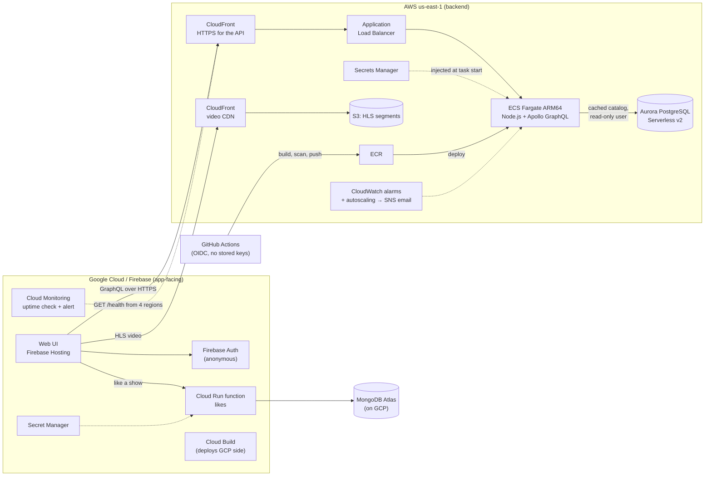

# Station Stream

A mini white-label streaming platform: **one shared backend gives several TV stations their own branded streaming app.** Each station has its own name, colors, theme and home-screen rows; all stations share one catalog API, one video pipeline and one deployment. The catalog is modeled on the PBS Media Manager structure (Franchise → Show → Season → Episode → Asset).

It is a hands-on reliability-engineering project across **AWS and Google Cloud**: containers on ECS, CDNs, Aurora Serverless, infrastructure as code, CI/CD with keyless auth, monitoring, chaos and load testing. Every step, error and fix is logged in [docs/](docs/).

**Live:**
- Web app (Firebase Hosting): https://station-stream-2026.web.app/?station=north (try `?station=south`)
- API health (AWS, via CloudFront): https://d1436kyrcdypmk.cloudfront.net/health

## Architecture



**Division of labor:** AWS runs the backend (one GraphQL API for every station and platform, the database, the video CDN). Google Cloud runs the app-facing side: web hosting, sign-in, a small event-driven function for per-user "liked videos", its own CI and an **external uptime check that watches the AWS API from outside AWS**.

The AWS backend exists twice, on purpose:

| | App 1 `station-stream` | App 2 `station-stream-tf` |
|---|---|---|
| Built with | AWS console, one resource at a time, to learn each piece | **Terraform** ([terraform/](terraform/)) |
| Deploys | GitHub Actions on push to `main` ([deploy.yml](.github/workflows/deploy.yml)) | `terraform apply` with a pinned image tag |
| Database | Bundled JSON catalog | **Aurora PostgreSQL Serverless v2** |
| Used by | Its own player page | The Firebase web app |

## Key design decisions

- **The API never serves video.** It returns metadata and video URLs; HLS segments go from S3 through CloudFront. Metadata through the API, media through the CDN.
- **Cache-first catalog.** The API keeps the catalog in memory and refreshes it from Aurora in the background at most once a minute, and only while there is traffic (stale-while-revalidate). Database load doesn't grow with viewers, and with no viewers Aurora **auto-pauses to 0 ACU** (about $0 compute). If Aurora is down, the API keeps serving the last good copy.
- **Health checks that can't cascade.** `/health` reports the catalog source and age but never queries the database. Otherwise a database blip would make the load balancer kill every task at once.
- **Private database, least privilege.** Aurora has no public access; its security group allows port 5432 only from the API tasks' security group. RDS generates the admin password into Secrets Manager, and only the migration task's role can read it. The API connects as a **read-only** Postgres user whose password ECS injects from its own secret.
- **Migrations as a one-off task.** Same image, different command (`node src/db/migrate.js`), run inside the VPC before the code that needs it. Idempotent.
- **Keyless CI/CD.** GitHub Actions assumes an AWS role through OIDC (trust pinned to the repo's numeric IDs, `main` only). Cloud Build deploys the GCP side as a dedicated service account.
- **Scoped humans and machines.** Daily work uses an IAM user that can only create roles named `station-stream-*` (it can't make itself admin); GCP uses dedicated service accounts instead of the default Editor account.

## Reliability work and results

**Chaos test** (stopped the only task on purpose): ~30 s of 503s. Only the load-balancer-5xx alarm fired; I pulled the raw metrics to explain why the other three didn't (missing datapoints, deregistration before stop). Lesson: alert on what users experience; one task is a single point of failure.

**Load test** with k6 ([loadtest/spike.js](loadtest/spike.js)): the same GraphQL query the page sends, 10 → 300 virtual users in 30 seconds.

| Run | Autoscaling | Errors | p95 | What happened |
|---|---|---|---|---|
| Baseline, 10 req/s | 1 task | 0 | 117 ms | 5% CPU, ~2 ms server time per request |
| Spike, original config | CPU 60%, max 2, 300 s cooldowns | 0 | 124 ms | One task carried ~300 req/s at 65% CPU; the second task arrived ~6 min later, after the spike |
| Spike, tuned | + requests-per-task policy, max 6 | 3 (0.003%) | 136 ms | Still ~5 min to react, then a needless extra task |

What it found and what changed:
- **Capacity:** one 0.25 vCPU Fargate task ≈ 300 req/s at ~65% CPU; plan 250 req/s per task. `tasks = ⌈peak / 250⌉ + 30–50% headroom`, minimum 2 in production.
- **Reactive scaling has a ~5-minute floor here** (3 one-minute datapoints + metric delay + task start), whatever the metric. So known events (premieres, pledge drives) need **scheduled scaling**; caching is the cheapest capacity.
- **Overshoot from a short cooldown:** the alarm still held the spike's last datapoint when a 60 s cooldown ended. Fixed: scale-out cooldown 180 s.
- **Rare 502s:** the ALB keeps idle connections for 60 s, Node closes them after 5 s. Fixed: `keepAliveTimeout` 65 s.

Full numbers: [docs/aws-breadcrumbs.md](docs/aws-breadcrumbs.md) (Phase L2).

## Tech stack

| Layer | Tools |
|---|---|
| API | Node.js 24, Express 5, Apollo Server 5 (GraphQL), `pg` |
| Web UI | HTML, hls.js, Tailwind CSS v4 |
| Video prep | ffmpeg (3-rung adaptive bitrate HLS) |
| Containers | Docker multi-stage build, ECR (scan on push, immutable tags) |
| AWS compute and traffic | ECS on Fargate (ARM64), Application Load Balancer, CloudFront |
| Data | Aurora PostgreSQL Serverless v2, S3, MongoDB Atlas |
| Secrets | AWS Secrets Manager, GCP Secret Manager |
| GCP | Firebase Hosting, Firebase Auth, Cloud Run functions, Cloud Build, Cloud Monitoring |
| Observability | CloudWatch Logs (JSON lines), 4 ALB alarms → SNS email, target-tracking autoscaling, GCP uptime check |
| Infrastructure as code | Terraform (AWS provider 6.x) |
| CI/CD | GitHub Actions (OIDC to AWS, native ARM runner), Cloud Build |
| Load testing | k6 (Docker) |

## Data model

```
Station (slug, callSign, name, tagline, brandColor, theme)
  └── HomeRow (title, position) ──> Show

Franchise
  └── Show (title, description)
        └── Season (number)
              └── Episode (title, number, durationSeconds)
                    └── Asset (object type, availability windows, images, HLS renditions)
```

All stations share the shows; each picks its own home-screen rows (the white-label part). In Postgres: 8 tables with text primary keys, foreign keys and JSONB for the asset fields whose shape varies ([src/db/schema.sql](src/db/schema.sql)).

## Repository layout

```
src/              GraphQL API (server.js, schema.js, catalog.js) and db/ (schema, migration, pool)
public/           Player page (hls.js + Tailwind)
data/             Sample catalog (Media Manager-shaped) and station themes
terraform/        App 2: network, ALB, ECS, CloudFront x2, S3, Aurora, IAM, alarms, autoscaling
infra/            App 1 task definition and IAM policies (scoped builder user, OIDC deploy role)
gcp/              Firebase config, Cloud Build pipeline, the likes function
loadtest/         k6 spike test, CloudWatch metrics helper, results
scripts/          ffmpeg HLS encoding, local CDN stand-in, hosting build
.github/          GitHub Actions deploy workflow
docs/             Step-by-step logs and the study guide
```

## Run locally

```bash
npm install
npm run dev      # API + player on http://localhost:4000/?station=north, local video CDN on :8080, Tailwind watcher
```
Without database settings the API uses the bundled JSON catalog. To use Postgres, set `PGHOST`, `PGUSER`, `PGPASSWORD`, `PGDATABASE` (and `PGSSL=off` for a local server), then run `node src/db/migrate.js` once. Video files aren't committed: `npm run video:encode` builds HLS from your own clips.

```bash
docker build -t station-stream .
docker run -p 4000:4000 station-stream
```

Load test (only against your own endpoint):
```bash
docker run --rm -i -e PROFILE=baseline -e API_BASE=https://<your-api> -v "$PWD/loadtest:/scripts" grafana/k6:2.3.0 run /scripts/spike.js
```

## Cost guardrails

- Budgets with email alerts on both clouds (AWS budget measured before credits).
- Smallest sizes: Fargate ARM64 0.25 vCPU / 0.5 GB, autoscaling capped at 6 tasks; Aurora 0–4 ACU with auto-pause; MongoDB Atlas free tier.
- No NAT gateway (tasks use public subnets with public IPs; security groups do the isolation).
- 7-day log retention, ECR lifecycle rule, `terraform destroy` for app 2.

## Security

- No root keys; no secrets in code or git (passwords live only in Secrets Manager / Secret Manager).
- OIDC for GitHub Actions, trust pinned to numeric repo/owner IDs and `main`.
- Least-privilege IAM: scoped builder user (verified with negative tests), separate execution roles for the API and the migration task, each limited to the secrets it needs, confused-deputy conditions on service trust policies.
- Security groups reference each other (ALB → task → database), not IP ranges.
- Private S3 bucket readable only by CloudFront (Origin Access Control).
- Container: non-root user, OS patches at build, image scanning, immutable tags.

## What I learned

The interview-style write-ups (symptom → diagnosis → fix → takeaway) are in [docs/STUDY_GUIDE.md](docs/STUDY_GUIDE.md). A few:

- **Read the error literally.** zsh passing two subnet IDs as one string; an OIDC trust policy that didn't match GitHub's immutable `sub` claim.
- **Verify the artifact, not the exit code.** Docker provenance attestations turned one push into three ECR entries, which the lifecycle rule could have used to delete a running image.
- **Least privilege needs evidence.** RDS creates its managed secret *with the caller's permissions*; CloudTrail plus a harmless probe call proved which statement was missing instead of widening access by guesswork.
- **Test the failure path.** A local "database down" test found that Node reports refused connections with an empty error message.
- **Test your alerts.** The chaos test showed which alarms actually fire for a short outage.
- **Load tests find real bugs.** Keep-alive 502s and an autoscaling overshoot, both invisible at normal traffic.

## Known gaps / next steps

- A second Aurora instance in another AZ (fast failover) and a minimum of 2 API tasks: today's single writer and single task are cost choices.
- TLS certificate verification to Aurora (`verify-full` with the RDS CA bundle).
- Scheduled scaling for known events; ALB access logs.
- Terraform for the GCP side; a teardown script for app 1.
- MongoDB Atlas: an app-specific read/write user and network peering instead of an open IP allowlist.

## Docs

- [docs/aws-breadcrumbs.md](docs/aws-breadcrumbs.md): every AWS command and console step, in order, with real errors and fixes
- [docs/gcp-breadcrumbs.md](docs/gcp-breadcrumbs.md): the same for Google Cloud
- [docs/STUDY_GUIDE.md](docs/STUDY_GUIDE.md): concepts, glossary, rebuild checklist, problems and lessons

## Video content

All video is my own original footage. Source files are not committed; only the ffmpeg scripts are.
