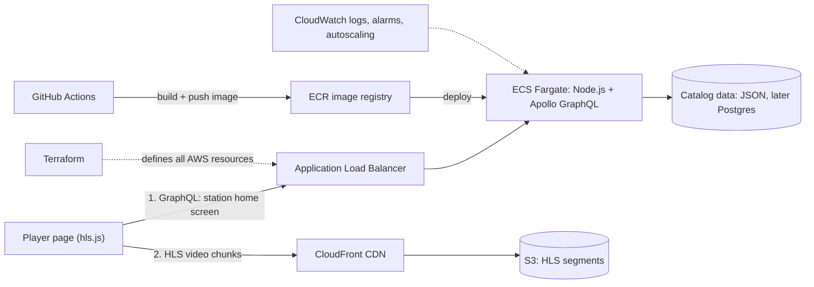

# Station Stream

A mini white-label streaming platform: one shared backend that gives multiple TV stations their own branded, Netflix-style streaming experience.

Each station gets its own name, colors, and home-screen rows, while all stations share one catalog API, one video pipeline, and one deployment. The catalog is modeled on the PBS Media Manager content structure (Franchise > Show > Season > Episode > Asset).

This is a learning project for cloud infrastructure and reliability engineering: containers, ECS, CDN delivery, monitoring, CI/CD, and infrastructure as code.

## Architecture



**Key design choice:** the API never serves video. It returns the catalog and video links only. Video chunks go straight from S3 through CloudFront to the viewer, the same split real streaming platforms use (API for metadata, CDN for media).

## Request flow

1. The player loads with a station slug, for example `?station=north`.
2. The player sends a GraphQL query to the API through the load balancer.
3. The API returns that station's branding and home-screen rows, with HLS video URLs pointing at CloudFront.
4. hls.js downloads the video in small chunks from the nearest CloudFront location and switches quality as bandwidth changes.

## Tech stack

| Layer | Tool | Purpose |
|---|---|---|
| API | Node.js, Apollo Server, GraphQL | Station-aware catalog API |
| Player | HTML + hls.js | Plays HLS video in any browser |
| Video prep | ffmpeg | Converts MP4 to HLS chunks at multiple quality levels |
| Container | Docker | Packages the API to run anywhere |
| Image registry | AWS ECR | Stores container images |
| Compute | AWS ECS on Fargate | Runs and restarts containers, scales them |
| Traffic | Application Load Balancer | Public entry point, health checks, spreads traffic |
| Video storage | AWS S3 | Stores HLS segments |
| CDN | AWS CloudFront | Serves video from locations near viewers |
| Observability | AWS CloudWatch | Logs, alarms, autoscaling metrics |
| CI/CD | GitHub Actions (OIDC to AWS) | Build, push, and deploy on every push to main |
| Infrastructure as code | Terraform | Defines and rebuilds all AWS resources |

## Data model

```
Station (slug, name, brandColor, logoUrl)
  └── HomeRow (title, order)  ──>  Show

Franchise
  └── Show (title, description, imageUrl)
        └── Season (number)
              └── Episode (title, number, durationSeconds)
                    └── Asset (hlsUrl, availability: public | members)
```

All stations share the same shows. Each station chooses its own home-screen rows, the "white-label" part.

## Example query

```graphql
query StationHome {
  station(slug: "north") {
    name
    brandColor
    homeRows {
      title
      shows {
        title
        seasons {
          episodes {
            title
            asset { hlsUrl availability }
          }
        }
      }
    }
  }
}
```

## Repository layout (planned)

```
api/            Node.js + Apollo GraphQL server, Dockerfile
api/data/       catalog.json (Media Manager-shaped sample data)
player/         index.html + hls.js player page
video/          ffmpeg scripts (source clips are not committed)
infra/          Terraform for ECR, ECS, ALB, S3, CloudFront, CloudWatch
.github/        GitHub Actions workflows
scripts/        teardown and helper scripts
```

## Roadmap

- [ ] 0. Setup: tools installed, AWS billing alarm, limited IAM user
- [ ] 1. GraphQL API and player page running on localhost
- [ ] 2. Own clips converted to HLS with ffmpeg, playing locally
- [ ] 3. API running in Docker locally
- [ ] 4. Image pushed to ECR
- [ ] 5. Running on ECS Fargate behind a load balancer, reachable on the public internet
- [ ] 6. Video in S3 served through CloudFront; API returns CloudFront URLs
- [ ] 7. CloudWatch logs, alarms, autoscaling; kill a task and watch ECS replace it
- [ ] 8. GitHub Actions deploys on push to main using OIDC (no stored AWS keys)
- [ ] 9. Whole stack rebuilt with Terraform; hand-built version removed
- [ ] 10. Teardown script and lessons learned

## Run locally

```bash
cd api
npm install
npm run dev            # GraphQL API on http://localhost:4000
```

Open `player/index.html?station=north` in a browser.

## Docker

```bash
# --platform matters on Apple Silicon Macs: ECS Fargate defaults to x86_64
docker build --platform linux/amd64 -t station-stream-api ./api
docker run -p 4000:4000 station-stream-api
```

## Health check

`GET /health` returns `200 OK`. The load balancer uses it to decide which containers receive traffic, and ECS replaces containers that fail it.

## Cost guardrails

- AWS billing alarm set at $10 before any resource is created.
- Smallest Fargate size (0.25 vCPU, 0.5 GB), one task.
- Public subnets with public IPs, no NAT gateway (a NAT gateway bills hourly).
- The load balancer, Fargate task and public IPv4 addresses bill by the hour. Run `scripts/teardown.sh` when not actively working.
- Check current prices on the AWS pricing pages; this project should cost a few dollars if torn down promptly.

## Security

- No AWS root account keys. A limited IAM user is used for setup.
- No secrets in code or git. `.env` files are gitignored.
- GitHub Actions authenticates to AWS with OIDC (short-lived credentials, nothing stored in GitHub).
- ECS tasks use a least-privilege task execution role.
- The S3 bucket is private; only CloudFront can read it (Origin Access Control).

## Video content

All video is my own original footage. Source MP4s are not committed; only the ffmpeg scripts are.

## What I learned

_Filled in as each phase is completed: what broke, how I diagnosed it, and what I changed._
